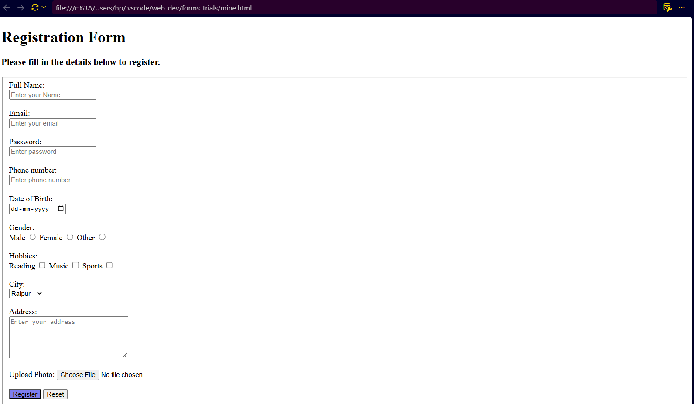

# My First HTML Forms 🌐

Welcome to my HTML Forms Practice Repository!

This repository contains HTML forms created by me while learning web development.

## 📌 About This Project

I am learning HTML and practicing different types of forms to improve my web development skills.

## 🛠️ Technologies Used

- HTML5

## 📋 Forms Created

- Registration Form

## 📸 Project Screenshot

## 🔗 Live Website

[View My HTML Form](https://ishikacodes3.github.io/my-first-html-forms/)

---

Created by **Ishika Sahu** ❤️
